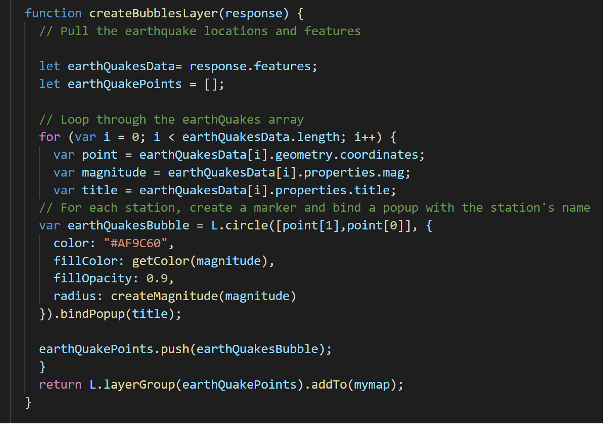
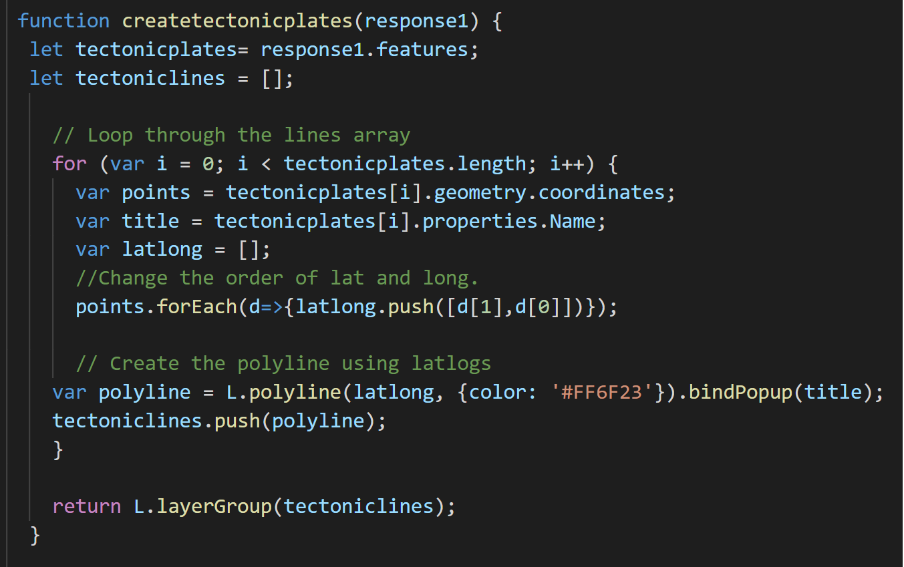
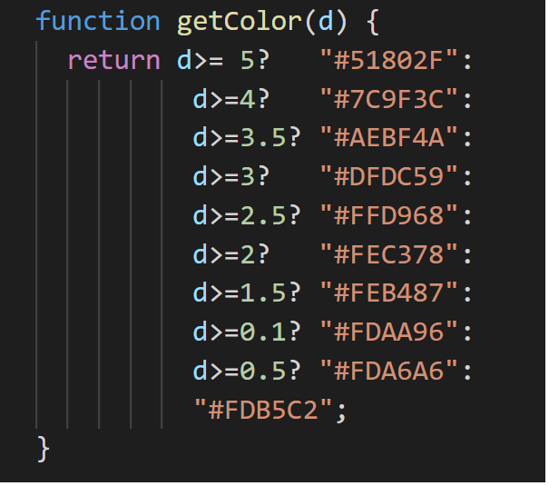
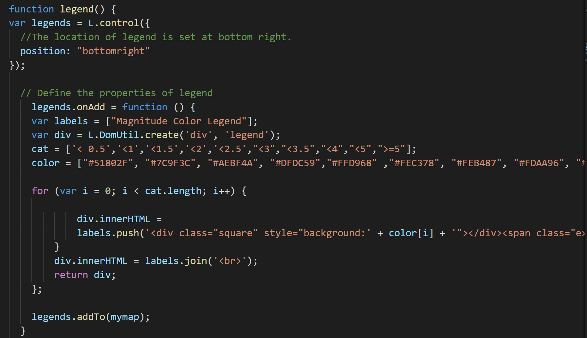

 **Leaflet-challenge Homework**
 1. In this homework, I use leaflet to map the location of earthquakes happened around the world found in USGS website in the last 7 days by calling API https://earthquake.usgs.gov/earthquakes/feed/v1.0/summary/all_week.geojson and tectonic plates information by API https://raw.githubusercontent.com/fraxen/tectonicplates/master/GeoJSON/PB2002_boundaries.json.
 
 2. I set up the map by creating the function createMap including 3 basemaps: lightmap, satelite and streetmap and 2 layers: earthquakes and tectonic plates. It is available for lightmap and earthquakes layer when the browser is loading.
 
 
 
 3. In order to create the layers, I made function for each layer. The function of createBubblesLayer will create bubbles of earthquakes happened in the map based on their latlong, while the function of createtectonicplates will make the polylines of tectonic plates on the map.
 

4. To support for the function of createBubblesLayer to have different colors of earthquakes depending on their magnitudes, I defined a function getColor() to map color strip for a range of magnitude.

5. In the map, the legend is shown by calling the function of legend().

6. The final work will look like the picture below:

