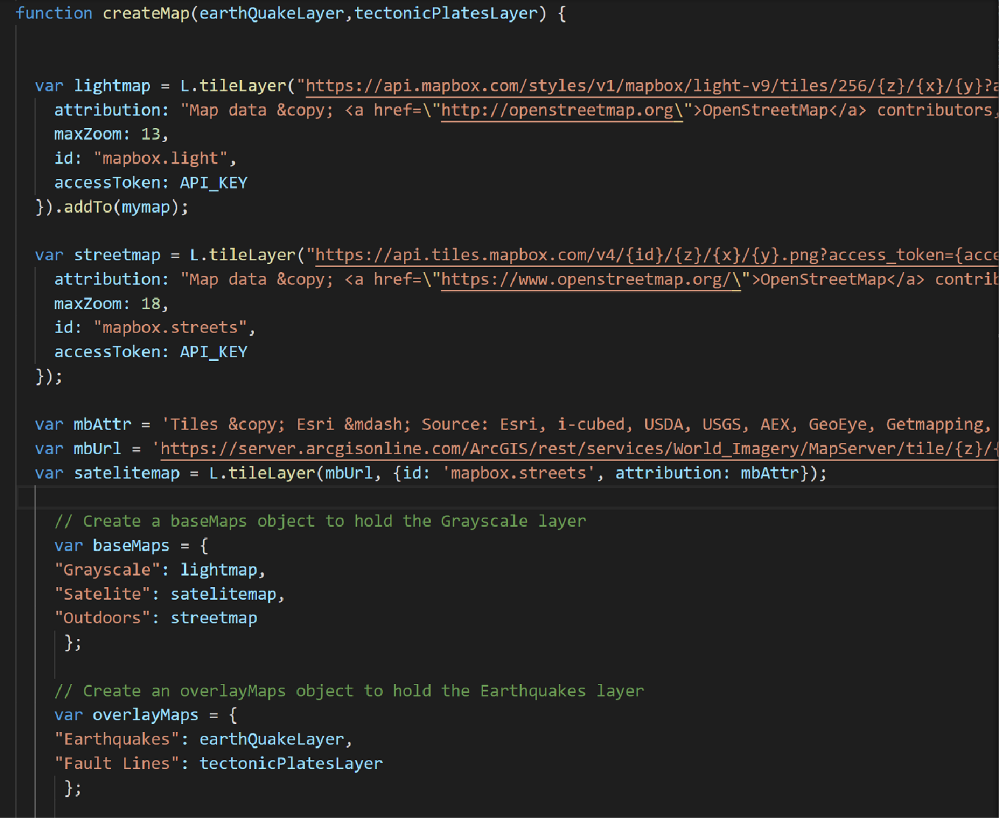

 Leaflet-challenge Homework
 1. In this homework, I use leaflet to map the location of earthquakes happened around the world found in USGS website in the last 7 days by calling API https://earthquake.usgs.gov/earthquakes/feed/v1.0/summary/all_week.geojson and tectonic plates information by API https://raw.githubusercontent.com/fraxen/tectonicplates/master/GeoJSON/PB2002_boundaries.json.
 
 2. I set up the map by creating the function createMap including 3 basemaps: lightmap, satelite and streetmap and 2 layers: earthquakes and tectonic plates.
 
 
 
 3. 
